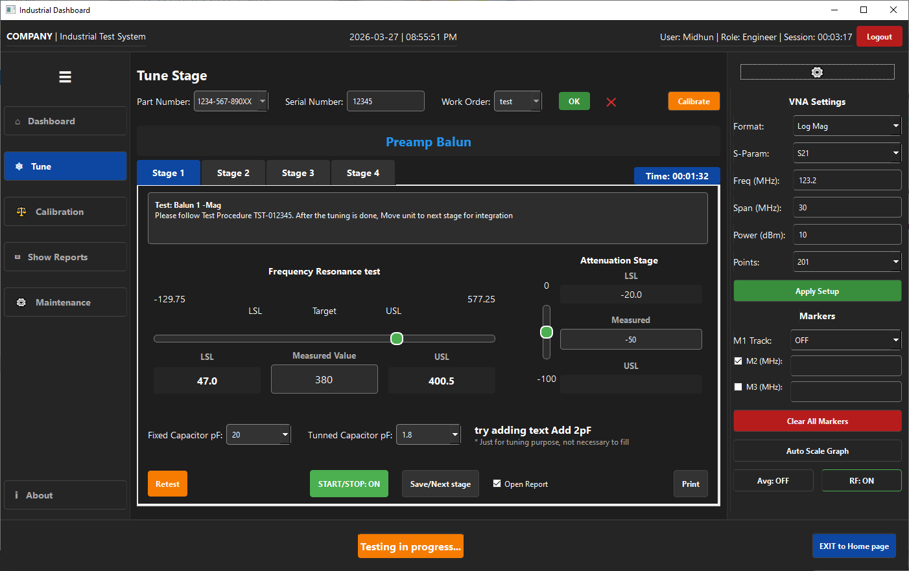
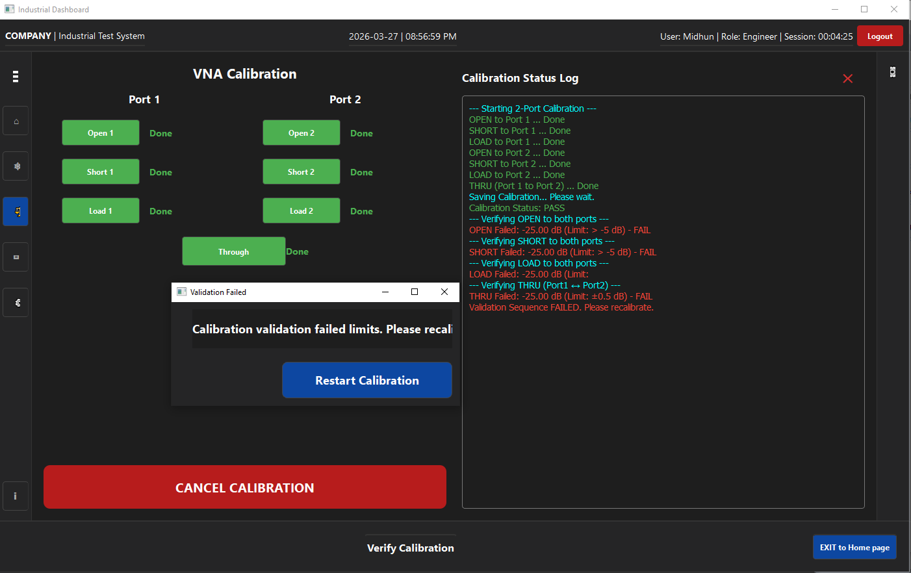

# 📡 RF Test Automation System

An advanced RF test automation framework built using Python for controlling industrial test equipment, executing automated test flows, and managing data through APIs and databases.

## Screenshots

## Documentation

🚀 Features

📊 Instrument Control (SCPI automation)
Automates RF measurements using SCPI commands with instruments like Keysight E5061B ENA Network Analyzer.

🔌 API Integration
Seamless communication with external systems for data exchange and workflow automation.

🗄️ Database Storage
Stores test results, logs, and configurations for traceability and analysis.

📏 Specification Definition Engine
Define RF test limits and validation criteria dynamically.

✅ Conditional Check System
Automated pass/fail evaluation based on user-defined specs.

👤 Role-Based Access Control (RBAC)
Secure login system with multiple user roles (Admin, Engineer, Viewer).

🖥️ Advanced Python GUI
User-friendly interface for test execution, monitoring, and configuration.

⚙️ Config File Support
Load and manage test configurations via external files (CSV/SQLite).

## 🏗️ System Architecture

User Interface (Python GUI)
        │
        ▼
Test Engine ──► Spec Validator ──► Conditional Checker
        │
        ├──► SCPI Controller ──► RF Instrument (E5061B)
        │
        ├──► API Layer
        │
        └──► Database Storage

## 🛠️ Technologies Used

🐍 Python (Automation & GUI)

📡 SCPI Protocol (Instrument Communication)

🌐 REST APIs

🗃️ SQL / NoSQL Database

🧩 PyQt / Tkinter (GUI Framework)
